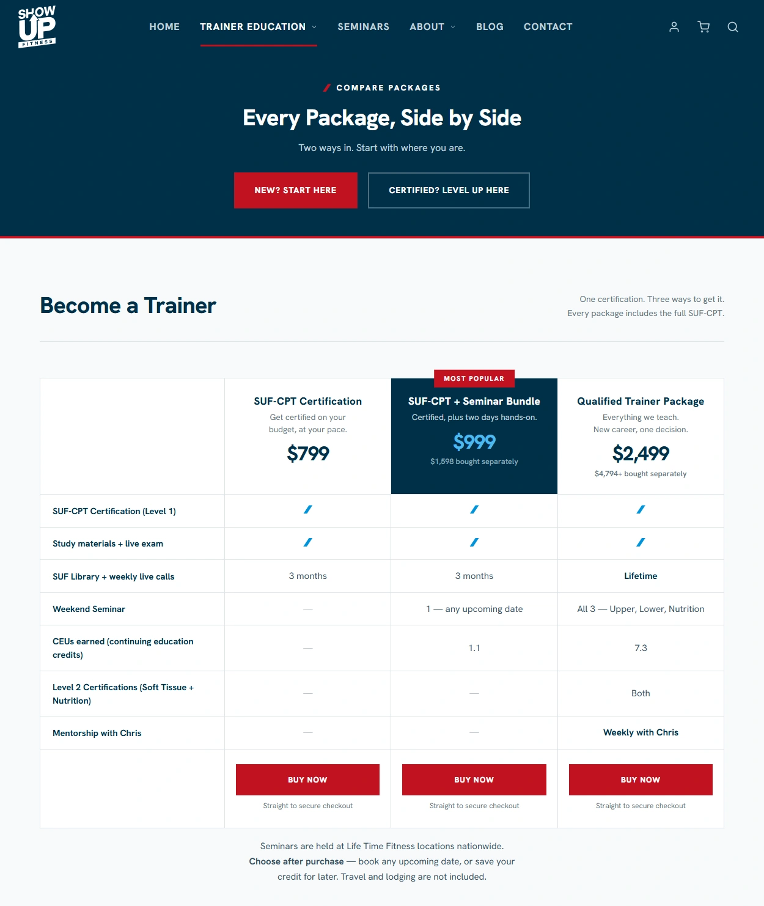
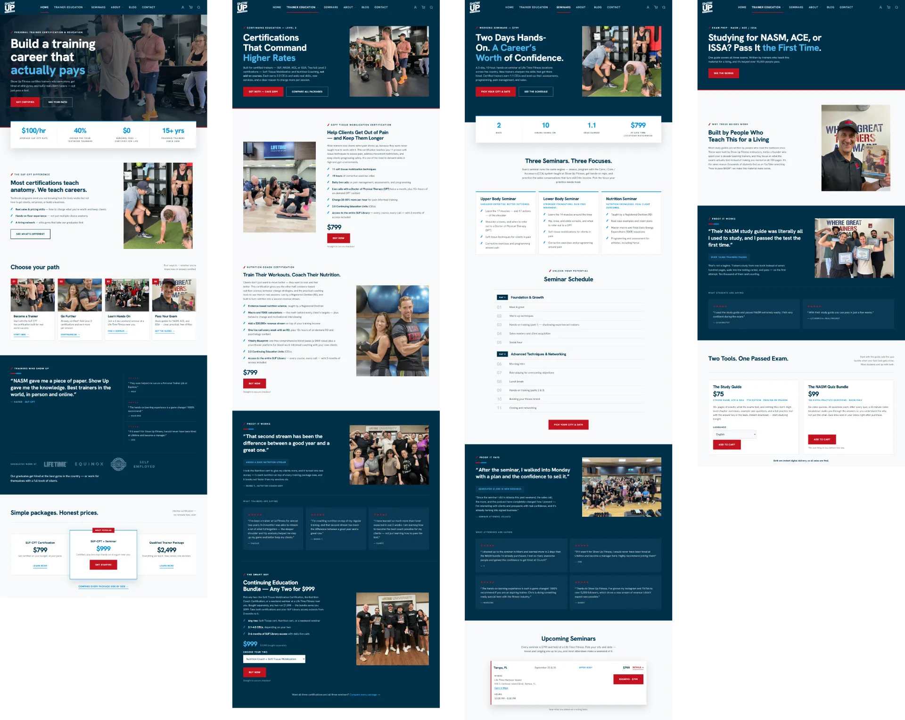
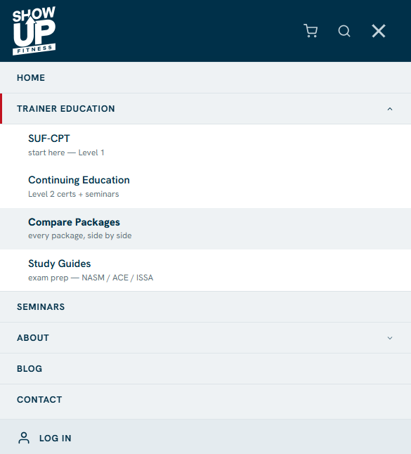

# Show Up Fitness — Shopify theme rebuild

Show Up Fitness sells personal trainer certifications and seminars, high-ticket
products starting at $799. The store was selling them like commodity goods: collection grids, 
standard product pages, packaged together in a dizzying array of overlapping bundles. 
A visitor could not tell what was for sale, how the products related, or 
why to pick one over another.

This project rebuilt the core selling pages as long form landing pages. Each
follows a standard blueprint: value proposition, pain, solution, features,
social proof, call to action. The product ladder is now explicit, base
certifications, level 2 certifications, seminars, comparable side by side,
and most buy buttons go straight to checkout, bypassing 
product pages entirely. **The store now says one thing clearly.**

This repository contains **only the code I wrote.** The inherited vendor theme
is excluded for licensing reasons; see
[Scope](#scope-what-is-and-is-not-here). Published with the merchant's
permission. Live site: [showupfitness.com](https://www.showupfitness.com)

<p align="left">
  <br>
  <em>The homepage hero. The only full-bleed photo treatment on the site; every other page opens on a compact band, so the homepage stays special.</em>
</p>

<p align="left">
  <br>
  <em>Compare packages. Each column's button goes direct to checkout, posting a variant id to the cart. No product page in between.</em>
</p>

<p align="left">
  <br>
  <em>Four of the eleven rebuilt pages, full length. One library of 30 sections composes all of them, every image and line of text editable in the Shopify editor.</em>
</p>

---

## The constraint: two environments side by side

The scope was the core selling pages, not the whole site. So the rebuilt pages
had to run beside the vendor theme, not replace it.

That vendor theme is Vintage-architecture Shopify: jQuery, select2,
handlebars, lazysizes, a 117 KB framework stylesheet. Refactoring it was off
the table, and not for budget reasons. Several of its stylesheets are not CSS
files at all: they are templates, built fresh on every request from whatever
the merchant has set in the theme editor. No build tool can compile
`color: {{ settings.blog_bg_color }}`. Rewrite those in Sass and every color
picker in the editor quietly stops working.

So the rule for all new work is **additive**: new code lives in its own
namespace, compiles to its own asset, and never edits a vendor file. Every
net-new file, class, custom property and template carries a `suf` prefix.

Leaving the old files alone is not enough. The new stylesheet ends
up being served on the inherited pages too, so a plain rule like
`p { margin: 0 0 24px }` would restyle all of them. Every base rule is written
to require a `suf-body` class that only the rebuilt pages carry.

## Architecture

Two layouts. Which one a page uses is the single biggest factor in what it
weighs.

| | `layout/theme.liquid` (vendor) | `layout/suf.liquid` (mine) |
|---|---|---|
| Used by | inherited templates (shop, blog, cart, product pages) | the rebuilt pages |
| Loads | jQuery, Swiper, select2, handlebars, lazysizes, 4 legacy stylesheets | one stylesheet, one ES module, one font |

The header and footer are **shared**:
`sections/suf-nav.liquid` and `sections/suf-footer.liquid` render on both
layouts and read one settings key, so the merchant edits the logo once and it
changes everywhere.

### The shared nav

<p align="left">
  <br>
  <em>The rebuilt nav on mobile. One section serves both legacy and new pages.</em>
</p>

A menu item with a submenu is a `<button>`, not a link. It opens a panel; it
does not go anywhere. A button says that, works with Enter and Space for free,
and needs no hover, which phones do not have. Where the item has a destination
of its own, it is repeated as the first row inside the panel.

Each button also carries `aria-expanded`, and the code that opens a panel
writes that attribute in the same breath. It used to be possible for CSS to
open a panel on hover while the attribute still said "false", so a screen
reader would announce the menu as closed while it sat open on screen. Now one
function does both, and what is announced always matches what is visible.

## Measured results

The same URL on both themes: the homepage on the vendor theme, and the
homepage rebuilt. Both served by Shopify, captured from the network panel.

**The theme layer, the part this project actually controls, dropped 79%,
from 331 KB across 19 requests to 68 KB across 12.**

| | Legacy `/` | Rebuilt `/` | |
|---|---|---|---|
| **Theme layer** | **19 req / 331 KB** | **12 req / 68 KB** | **−79%** |
| Page builders (PageFly + ECB) | 12 req / 140 KB | 0 | gone |
| Requests | 313 | 253 | −19% |
| Wire | 3,082 KB | 1,958 KB | −36% |
| Decoded | 7,671 KB | 4,565 KB | −40% |
| Shopify platform | 186 req / 465 KB | 181 req / 459 KB | −1% |

Of the 1,124 KB saved, about 403 KB is the theme layer and the page builders
it replaced.

On the rebuilt homepage, Shopify's own platform plus Google account for half
the wire weight. The theme is 3.5% of it.

## Three problems worth reading about

### 1. Scoping the base layer broke every component, silently

**A scoped base rule outweighed every single-class component rule. The fix was
`:where()`, which scopes at zero specificity.**

A base rule like `.suf-body p` carries a class plus an element. A component
class like `.suf-cta__subhead` carries only a class, so the base rule outranks
it no matter which loads last. Nothing errored; DevTools showed the component
rule present, struck through. It shipped repeatedly before the pattern was
recognized: blue link text on buttons, a centered subhead sitting left, footer
headings at 42px.

The first fix was an exclusion list,
`a:not(:where(.suf-btn, .suf-link, ...))`, one file remembering what every
other file was doing. A maintenance bomb, forgotten twice. The real fix:

```scss
:where(.suf-body) {
  p, ul, ol { margin: 0 0 var(--suf-space-md); }
}
```

`:where()` adds no weight of its own. The base layer still reaches only the
rebuilt pages, but now sits underneath every component instead of competing
with them, which is what a base layer is for.

### 2. The brand font had never rendered, and nobody knew

**The declared font files were corrupt and had been shipping 193 KB of
unusable bytes on every page load. The site had always rendered in Arial.**

The `@font-face` had a real bug, a stray `;` truncating the `src` list, but
fixing it changed nothing. At some point all four font files had been saved as
text, which destroys binary data: every non-text byte was swapped for a
placeholder character. Each file was 75% larger than its own header claimed,
and none of the font data inside could be read. Unrepairable.

Replaced with a self-hosted OFL font: a single variable file that covers every
weight from light to black, in fewer bytes than the three separate files it
replaced.

### 3. What the buyer chooses is a line item property, not a variant

**Certification bundles ask the buyer questions. Variants are the obvious
Shopify answer but the wrong one.**

Variants exist to vary price, inventory or SKU. None of these do: every
combination costs the same. Worse, a bundle offering three certifications and
a dozen seminars means one hand-made variant for every pairing, edited again
each time a seminar is added or retired.

The choices are `properties[...]` inputs on the buy form instead. Nothing is
configured in Shopify at all: the theme writes them, and they follow the order
through to the cart, the checkout, the confirmation email and the merchant's
exports.

One related constraint: Liquid cannot sort products by a metafield, so the
seminar list builds a sortable date key per product and sorts that instead.

## Scope: what is and is not here

**Here:** every file I wrote. 30 sections, 13 snippets, 31 Sass partials, 10
page templates serving eleven pages, 7 ES modules, the build config, the audit
tool, and the documentation. About 10,300 lines of Sass, 6,400 of Liquid, 600
of JavaScript, across 190 commits.

**Not here**, stripped from every commit rather than deleted at the tip:

- the purchased ThemeForest theme
- four files carrying my prefix that were forked or copied from vendor code
- three gym logos, somebody else's trademarks

About 29 commits in this history are empty. Their work was jQuery removal,
FontAwesome retirement, and deleting dead vendor sections: real work whose
subject was vendor code. The messages stay because the arc matters.

**Client details are anonymized.** Phone numbers, emails, addresses, prices and
identifiers are placeholders. The brand, product names and copy remain, with
the merchant's permission.

## Running it

```bash
npm install
npm run dev          # sass --watch -> assets/suf.css
```

`assets/suf.css` is generated and gitignored, so a fresh clone has no compiled
CSS. Build first. Rendering the Liquid needs a Shopify store and the Shopify
CLI; without one, read the source.

| | |
|---|---|
| `npm run dev` | Sass watch build |
| `npm run css:build` | one-off compressed build |
| `npm run lint` | Theme Check |
| `npm run lint:css` | Stylelint |
| `npm run audit:css` | specificity audit; needs `shopify theme dev` running, it reads the rendered DOM |

## Documentation

Written for whoever maintains this next.

| | |
|---|---|
| [`docs/architecture.md`](docs/architecture.md) | the additive rule, the two layouts, the specificity trap in full, the accessibility baseline, the commerce data model |
| [`docs/workflow.md`](docs/workflow.md) | environment, lint policy, comment and commit conventions |
| [`docs/wsl-tooling.md`](docs/wsl-tooling.md) | a catalogue of cross-shell failures that do not look like what they are |

## License

The code here is mine; see [`LICENSE`](LICENSE). `OFL.txt` is the SIL Open
Font License covering the bundled font and must travel with it.
